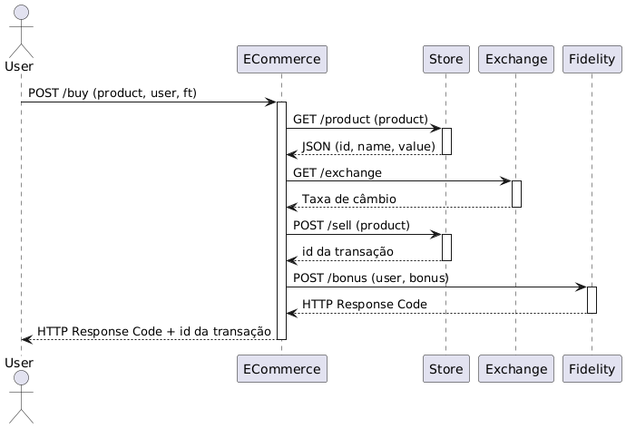

# Relatório: Implementação de Tolerância a Falhas em Sistema de E-commerce

## Sumário
1. [Introdução](#introdução)
2. [Visão Geral da Arquitetura](#visão-geral-da-arquitetura)
3. [Estratégias de Tolerância a Falhas](#estratégias-de-tolerância-a-falhas)
4. [Implementação Detalhada](#implementação-detalhada)
5. [Limitações e Considerações](#limitações-e-considerações)
6. [Estratégias Alternativas](#estratégias-alternativas)
7. [Casos de Teste para Apresentação](#casos-de-teste-para-apresentação)

## Introdução

Este relatório detalha a implementação de mecanismos de tolerância a falhas em um sistema de e-commerce distribuído. O sistema é composto por quatro microserviços (E-commerce, Store, Exchange e Fidelity) que se comunicam via REST, cada um com suas próprias responsabilidades e características de falha específicas.

O objetivo principal foi implementar estratégias robustas de tolerância a falhas que permitam que o sistema continue operando mesmo quando alguns de seus componentes falham, mantendo a qualidade do serviço e a experiência do usuário.

## Visão Geral da Arquitetura

### Componentes do Sistema

1. **Serviço E-commerce**
   - Ponto de entrada do sistema
   - Orquestra as chamadas aos outros serviços
   - Implementa os mecanismos de tolerância a falhas

2. **Serviço Store**
   - Gerencia produtos e vendas
   - Fornece informações de produtos
   - Processa transações de venda

3. **Serviço Exchange**
   - Fornece taxas de câmbio
   - Simula um serviço de cotação de moedas

4. **Serviço Fidelity**
   - Gerencia o programa de fidelidade
   - Registra bônus para usuários

### Fluxo de Comunicação



## Estratégias de Tolerância a Falhas

### 1. Store Service (Omission & Error)

#### Falha no Request 1 (GET /product)
- **Tipo**: Omission
- **Probabilidade**: 0.2 (20%)
- **Duração**: 0s
- **Estratégia Implementada**: Circuit Breaker com Fallback
  ```java
  @CircuitBreaker(name = "storeProduct", fallbackMethod = "fallbackProduct")
  @TimeLimiter(name = "storeProduct")
  private ProductResponse getProduct(Long productId, boolean ft) {
      // ... código de implementação
  }
  ```
- **Configuração**:
  ```yaml
  resilience4j.circuitbreaker:
    instances:
      storeProduct:
        slidingWindowSize: 10
        failureRateThreshold: 50
        waitDurationInOpenState: 5s
  ```

#### Falha no Request 3 (POST /sell)
- **Tipo**: Error
- **Probabilidade**: 0.1 (10%)
- **Duração**: 5s
- **Estratégia Implementada**: Circuit Breaker com Fallback
  - Geração de ID de transação alternativo em caso de falha
  - Estado de erro mantido por 5s
  ```java
  private String fallbackSale(Long productId, Throwable t, boolean ft) {
      return UUID.randomUUID().toString();
  }
  ```

### 2. Exchange Service (Crash)

#### Falha no Request 2 (GET /exchange)
- **Tipo**: Crash
- **Probabilidade**: 0.1 (10%)
- **Duração**: Indefinida
- **Estratégia Implementada**: Cache do Último Valor Válido
  ```java
  private final AtomicReference<Double> lastKnownRate = new AtomicReference<>(1.0);
  
  private double fallbackExchangeRate(Throwable t, boolean ft) {
      return lastKnownRate.get();
  }
  ```

### 3. Fidelity Service (Time)

#### Falha no Request 4 (POST /bonus)
- **Tipo**: Time
- **Probabilidade**: 0.1 (10%)
- **Duração**: 30s
- **Delay**: 2s
- **Estratégia Implementada**: Processamento Assíncrono com Retry
  ```java
  private final List<FidelityRequest> pendingFidelityRequests = new LinkedList<>();
  private final AtomicReference<LocalDateTime> degradeModeStart = new AtomicReference<>(null);
  ```

## Implementação Detalhada

### 1. Timeout Global

Todas as requisições têm timeout de 1 segundo, implementado via Resilience4j:
```yaml
resilience4j.timelimiter:
  instances:
    default:
      timeoutDuration: 1s
```

### 2. Circuit Breakers

Configurações específicas para cada tipo de falha:
```yaml
resilience4j.circuitbreaker:
  instances:
    storeProduct:
      slidingWindowSize: 10
      failureRateThreshold: 50
      waitDurationInOpenState: 5s
    exchangeRate:
      slidingWindowSize: 10
      failureRateThreshold: 50
      waitDurationInOpenState: 30s
```

### 3. Processamento Assíncrono

Implementado para o serviço Fidelity:
1. **Armazenamento de Requisições**:
   ```java
   private void storeFidelityRequest(Long userId, int bonus) {
       pendingFidelityRequests.add(new FidelityRequest(userId, bonus));
   }
   ```

2. **Processador em Background**:
   ```java
   private void startPendingBonusProcessor() {
       CompletableFuture.runAsync(() -> {
           while (true) {
               if (!isInDegradeMode() && !pendingFidelityRequests.isEmpty()) {
                   processPendingBonuses();
               }
               Thread.sleep(5000);
           }
       });
   }
   ```

## Limitações e Considerações

### 1. Armazenamento em Memória
- Os dados são mantidos em memória, sendo perdidos em caso de reinicialização
- Solução: Implementar persistência com MongoDB

### 2. Circuit Breaker
- Configuração estática dos parâmetros
- Possível melhoria: Configuração dinâmica baseada em métricas

### 3. Cache do Exchange
- Não há expiração do último valor conhecido
- Possível melhoria: Implementar TTL para o cache

### 4. Processamento Assíncrono
- Sem persistência das requisições pendentes
- Possível perda de requisições em caso de falha do serviço

## Estratégias Alternativas

### 1. Para o Store Service
- **Replicação Ativa**: Manter múltiplas instâncias sincronizadas
- **Padrão Saga**: Para transações distribuídas
- **Cache Local**: Para informações de produtos

### 2. Para o Exchange Service
- **Pooling de Valores**: Manter histórico de taxas
- **Fonte Alternativa**: Serviço secundário de câmbio
- **Predição de Valores**: Baseado em histórico

### 3. Para o Fidelity Service
- **Event Sourcing**: Para garantir processamento eventual
- **Dead Letter Queue**: Para requisições com falha
- **Compensating Transactions**: Para correção de inconsistências

## Casos de Teste para Apresentação

### 1. Cenário Base (Sem Falhas)
**Objetivo**: Demonstrar o fluxo normal de compra sem falhas ativadas.
```bash
# Requisição de compra normal
curl -X POST "http://localhost:8080/buy?product=1&user=1&ft=false"
```
**Resultado Esperado**:
- Retorna ID da transação
- Tempo de resposta < 1s
- Status 200 OK

### 2. Falha no Store (Omission)
**Objetivo**: Demonstrar o Circuit Breaker em ação no serviço Store.

#### 2.1 Teste de Falha Omission (Request 1)
```bash
# Fazer várias requisições para trigger do Circuit Breaker
for i in {1..10}; do
    curl -X POST "http://localhost:8080/buy?product=1&user=1&ft=true"
done
```
**Resultado Esperado**:
- ~20% das requisições falham (p=0.2)
- Circuit Breaker ativa após falhas
- Fallback retorna produto padrão
- Log mostra mensagem "Product service failed, using fallback"

#### 2.2 Teste de Falha Error (Request 3)
```bash
# Testar falha na venda
curl -X POST "http://localhost:8080/buy?product=1&user=1&ft=true"
```
**Resultado Esperado**:
- 10% de chance de falha por 5s
- Em caso de falha, retorna ID de transação alternativo
- Log mostra mensagem "Store service failed, using fallback transaction ID"

### 3. Falha no Exchange (Crash)
**Objetivo**: Demonstrar o cache do último valor válido.

```bash
# 1. Primeira requisição para obter um valor válido
curl -X POST "http://localhost:8080/buy?product=1&user=1&ft=true"

# 2. Requisições subsequentes após crash
for i in {1..5}; do
    curl -X POST "http://localhost:8080/buy?product=1&user=1&ft=true"
    sleep 1
done
```
**Resultado Esperado**:
- Primeira requisição armazena taxa de câmbio
- Após crash (10% de chance), usa último valor conhecido
- Log mostra "Exchange service failed, using last known rate"
- Serviço permanece em crash até reinicialização

### 4. Falha no Fidelity (Time)
**Objetivo**: Demonstrar o processamento assíncrono de bônus.

```bash
# 1. Requisição inicial
curl -X POST "http://localhost:8080/buy?product=1&user=1&ft=true"

# 2. Monitorar logs por 35 segundos
# Aguardar processamento dos bônus pendentes
```
**Resultado Esperado**:
- 10% das requisições demoram 2s
- Serviço entra em modo de degradação por 30s
- Bônus são armazenados para processamento posterior
- Após 30s, sistema tenta reprocessar bônus pendentes
- Logs mostram:
  - "Storing request for later"
  - "Processing pending bonus"
  - "Bonus processed successfully"

### 5. Teste de Carga com Falhas
**Objetivo**: Demonstrar comportamento sob múltiplas falhas simultâneas.

```bash
# Executar 100 requisições em paralelo
for i in {1..100}; do
    curl -X POST "http://localhost:8080/buy?product=1&user=1&ft=true" &
done
```
**Resultado Esperado**:
- Sistema continua respondendo
- Circuit Breakers ativam conforme necessário
- Bônus são processados eventualmente
- Logs mostram diferentes tipos de falhas e recuperações

### 6. Teste de Timeout Global
**Objetivo**: Verificar o timeout de 1s em todas as requisições.

```bash
# Requisição com ft=false para ver timeout
curl -X POST "http://localhost:8080/buy?product=1&user=1&ft=false"
```
**Resultado Esperado**:
- Requisições que demoram mais de 1s são canceladas
- Status 500 com mensagem de timeout
- Com ft=true, fallbacks são acionados

### Roteiro de Demonstração

1. **Preparação (2 minutos)**
   - Mostrar arquitetura do sistema
   - Explicar os tipos de falha

2. **Demonstrações (15 minutos)**
   - Executar cada caso de teste
   - Mostrar logs relevantes
   - Explicar comportamentos observados

3. **Análise (3 minutos)**
   - Discutir limitações encontradas
   - Apresentar possíveis melhorias
   - Mostrar métricas de resiliência

**Observações para Apresentação**:
- Ter todos os serviços rodando
- Terminal com logs visíveis
- Preparar comandos curl em um script
- Destacar mensagens importantes nos logs
- Mostrar configurações relevantes

## Conclusão

A implementação atual atende aos requisitos especificados, fornecendo mecanismos robustos de tolerância a falhas. As estratégias escolhidas priorizam:
1. Disponibilidade do sistema
2. Degradação graciosa
3. Recuperação automática
4. Consistência eventual

As limitações identificadas podem ser endereçadas em futuras iterações, principalmente através da implementação de persistência e melhorias nos mecanismos de monitoramento.
